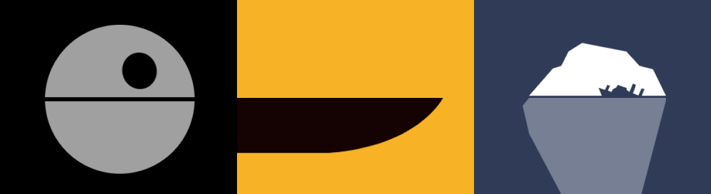

# 🎬 Minimalist Movie Posters  

### **Code that recreates, animates, and brings movie posters to life using only CSS.**  

  

Taking static images created by various artists, this project transforms them into **pure CSS code**, bringing each poster to life with **animations designed specifically** for its style. More than just a recreation, each image becomes a **small visual experiment**, where movement complements the essence of the original design. The navigation is smooth and adaptive, working seamlessly on **both mobile and desktop**.  

As you scroll, when a poster comes into focus at the center of the screen, **it captures all attention**, standing out with **more vivid colors** and triggering **an animation that progressively builds it**. Only when the animation completes does the **artist's full design reveal itself**.  

Movie titles appear in the language you know them by, avoiding those moments when you wonder if they were always called that. 🦈 **Jaws** will still be *Tiburón*, **The Shining** will be *El Resplandor*, and **Home Alone** won’t suddenly become *Maman, j'ai raté l'avion!* (or vice versa).  

> "You're gonna need a bigger boat."  
> — Martin Brody, *Jaws*  

🔗 **[Visit the project](https://posters.manumorante.com)**  
